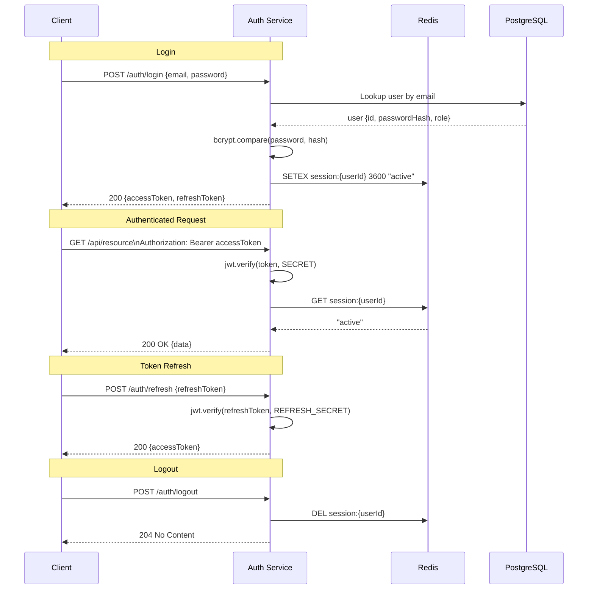
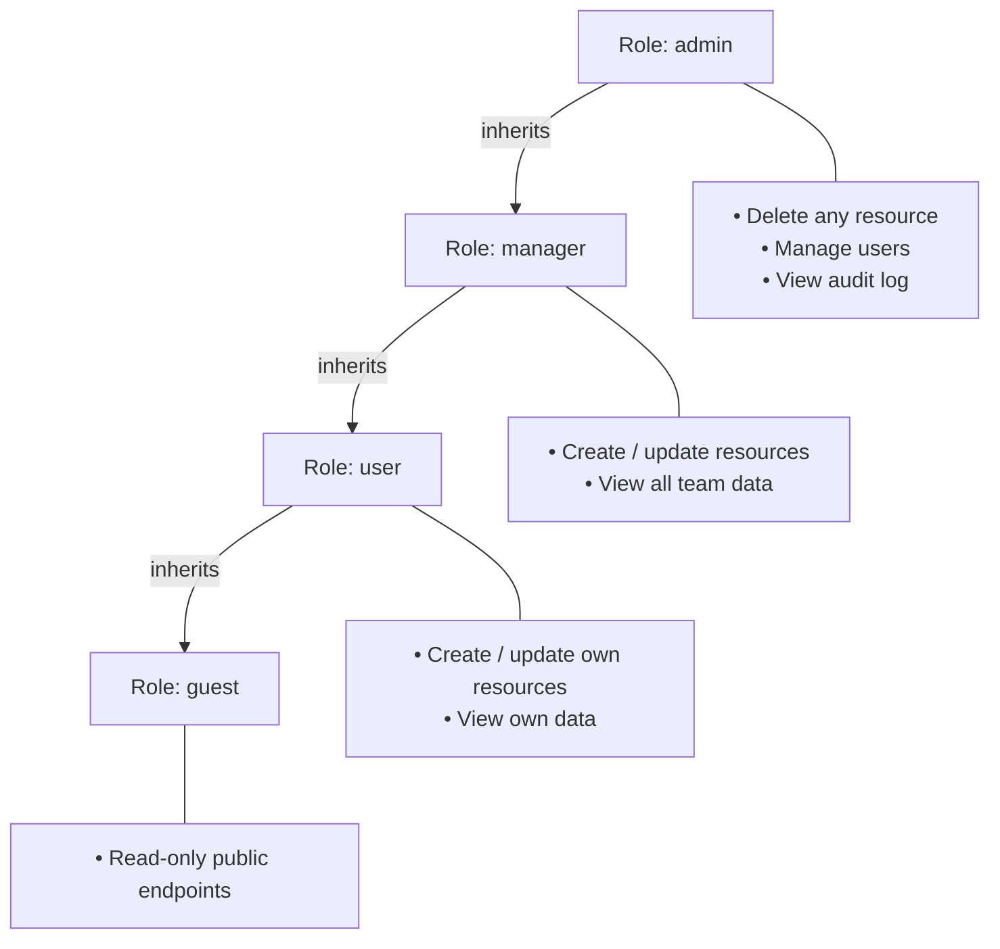

# Authentication

The API uses **JWT (JSON Web Tokens)** for authentication. Short-lived access tokens are paired with longer-lived refresh tokens to balance security with convenience.

## Token Lifetimes

| Token | Lifetime | Storage recommendation |
|-------|----------|------------------------|
| Access token | 15 minutes | In-memory (not localStorage) |
| Refresh token | 7 days | HttpOnly cookie |

## Authentication Flow



## Endpoints

### `POST /auth/register`

Create a new user account.

**Request body**

```json
{
  "name": "Jane Doe",
  "email": "jane@example.com",
  "password": "Sup3rS3cr3t!"
}
```

**Response `201 Created`**

```json
{
  "data": {
    "userId": "d4f2c1b0-...",
    "accessToken": "eyJhbGci...",
    "refreshToken": "eyJhbGci..."
  }
}
```

---

### `POST /auth/login`

Authenticate an existing user.

**Request body**

```json
{
  "email": "jane@example.com",
  "password": "Sup3rS3cr3t!"
}
```

**Response `200 OK`**

```json
{
  "data": {
    "accessToken": "eyJhbGci...",
    "refreshToken": "eyJhbGci...",
    "expiresIn": 900
  }
}
```

---

### `POST /auth/refresh`

Obtain a new access token using a valid refresh token.

**Request body**

```json
{
  "refreshToken": "eyJhbGci..."
}
```

**Response `200 OK`**

```json
{
  "data": {
    "accessToken": "eyJhbGci...",
    "expiresIn": 900
  }
}
```

---

### `POST /auth/logout`

Revoke the current session.

**Headers:** `Authorization: Bearer <accessToken>`

**Response `204 No Content`**

---

## Role-based Access Control (RBAC)



## Password Rules

- Minimum 8 characters
- At least one uppercase letter
- At least one digit
- At least one special character (`!@#$%^&*`)

## Security Notes

- Passwords are hashed with **bcrypt** (cost factor 12).
- Access tokens are signed with **RS256** (asymmetric keys).
- Refresh tokens are stored as an **HttpOnly**, **Secure**, **SameSite=Strict** cookie.
- Failed login attempts are rate-limited: **5 attempts per 15 minutes** per IP.
