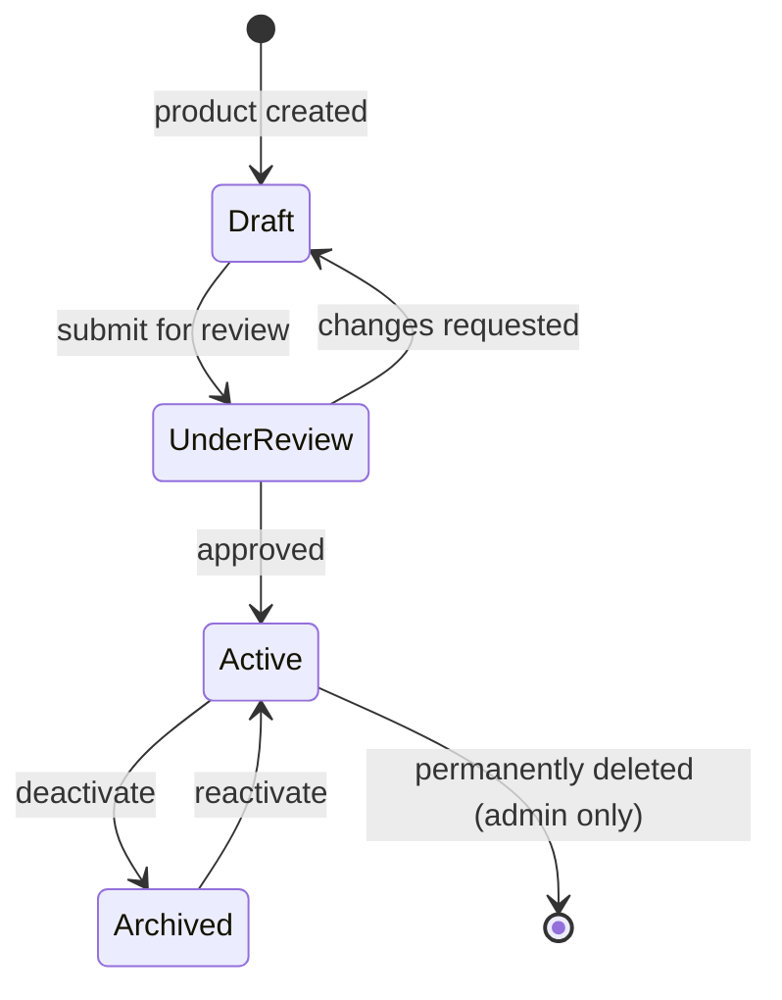
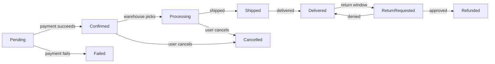
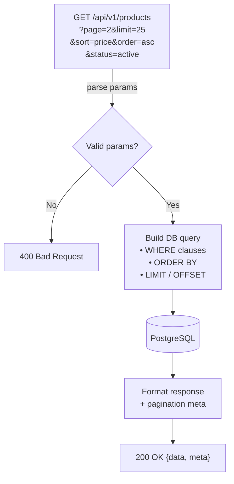

# API Endpoints

Complete reference for all REST API endpoints.

## Users

### `GET /api/v1/users`

Return a paginated list of users. Requires `manager` role or above.

**Query parameters**

| Param | Type | Default | Description |
|-------|------|---------|-------------|
| `page` | integer | `1` | Page number |
| `limit` | integer | `20` | Results per page (max 100) |
| `search` | string | – | Filter by name or email |
| `role` | string | – | Filter by role (`admin`, `manager`, `user`) |

**Example request**

```bash
curl -X GET "https://api.example.com/v1/users?page=1&limit=10" \
  -H "Authorization: Bearer eyJhbGci..."
```

**Response `200 OK`**

```json
{
  "data": [
    {
      "id": "d4f2c1b0-...",
      "name": "Jane Doe",
      "email": "jane@example.com",
      "role": "user",
      "createdAt": "2024-01-15T08:30:00Z"
    }
  ],
  "meta": {
    "page": 1,
    "limit": 10,
    "total": 42,
    "totalPages": 5
  }
}
```

---

### `GET /api/v1/users/:id`

Fetch a single user by ID.

**Response `200 OK`**

```json
{
  "data": {
    "id": "d4f2c1b0-...",
    "name": "Jane Doe",
    "email": "jane@example.com",
    "role": "user",
    "createdAt": "2024-01-15T08:30:00Z",
    "updatedAt": "2024-03-10T14:22:00Z"
  }
}
```

---

### `PATCH /api/v1/users/:id`

Update user fields. Users may only update their own record; admins may update any.

**Request body** (all fields optional)

```json
{
  "name": "Jane Smith",
  "email": "jane.smith@example.com"
}
```

---

### `DELETE /api/v1/users/:id`

Soft-delete a user account. Requires `admin` role.

**Response `204 No Content`**

---

## Products

### Product State Machine



### `POST /api/v1/products`

Create a new product. Requires `manager` role.

**Request body**

```json
{
  "name": "Widget Pro",
  "description": "An amazing widget.",
  "price": 49.99,
  "currency": "USD",
  "sku": "WGT-PRO-001",
  "categoryId": "a1b2c3d4-..."
}
```

**Response `201 Created`**

```json
{
  "data": {
    "id": "e5f6g7h8-...",
    "name": "Widget Pro",
    "status": "draft",
    "price": 49.99,
    "currency": "USD",
    "sku": "WGT-PRO-001",
    "createdAt": "2024-06-01T10:00:00Z"
  }
}
```

---

### `GET /api/v1/products`

List products with optional filters.

**Query parameters**

| Param | Type | Description |
|-------|------|-------------|
| `status` | string | `draft`, `active`, `archived` |
| `categoryId` | UUID | Filter by category |
| `minPrice` | number | Minimum price |
| `maxPrice` | number | Maximum price |

---

## Orders

### Order Lifecycle



### `POST /api/v1/orders`

Place a new order.

**Request body**

```json
{
  "items": [
    { "productId": "e5f6g7h8-...", "quantity": 2 }
  ],
  "shippingAddressId": "addr-uuid-...",
  "paymentMethodId": "pm_stripe_..."
}
```

**Response `201 Created`**

```json
{
  "data": {
    "orderId": "ord-uuid-...",
    "status": "pending",
    "total": 99.98,
    "currency": "USD",
    "estimatedDelivery": "2024-06-05"
  }
}
```

---

## Files

### `POST /api/v1/files`

Upload a file. Uses `multipart/form-data`.

**Form fields**

| Field | Type | Required | Description |
|-------|------|----------|-------------|
| `file` | binary | Yes | The file to upload (max 50 MB) |
| `visibility` | string | No | `public` or `private` (default: `private`) |

**Allowed MIME types:** `image/jpeg`, `image/png`, `image/webp`, `application/pdf`, `text/csv`

**Response `201 Created`**

```json
{
  "data": {
    "fileId": "f9e8d7c6-...",
    "filename": "report.pdf",
    "url": "https://cdn.example.com/files/report.pdf",
    "size": 204800,
    "mimeType": "application/pdf"
  }
}
```

---

## Pagination, Filtering & Sorting


