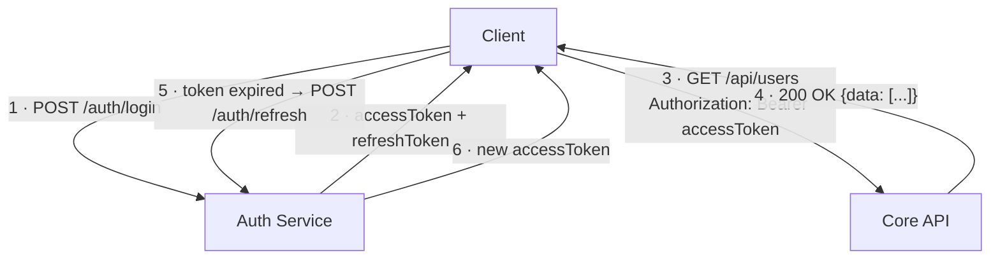

# API Overview

The platform exposes a RESTful HTTP API. All requests and responses use **JSON** unless otherwise noted.

## Base URL

| Environment | Base URL |
|-------------|----------|
| Production | `https://api.example.com/v1` |
| Staging | `https://api-staging.example.com/v1` |
| Local dev | `http://localhost:3002/v1` |

## Versioning

The API uses **URL-based versioning** (`/v1`, `/v2`, …). Breaking changes always increment the major version.

## Common Headers

| Header | Required | Description |
|--------|----------|-------------|
| `Authorization` | Yes (most endpoints) | `Bearer <access_token>` |
| `Content-Type` | Yes (POST/PUT/PATCH) | `application/json` |
| `Accept` | No | Defaults to `application/json` |
| `X-Request-ID` | Recommended | Client-generated UUID for tracing |

## Standard Response Shape

```json
{
  "data": { },
  "meta": {
    "requestId": "c3b9e1a2-...",
    "timestamp": "2024-06-01T12:00:00Z"
  }
}
```

Error responses follow [RFC 7807 Problem Details](https://datatracker.ietf.org/doc/html/rfc7807):

```json
{
  "type": "https://api.example.com/errors/validation",
  "title": "Validation Error",
  "status": 422,
  "detail": "The 'email' field must be a valid email address.",
  "instance": "/api/v1/users"
}
```

## HTTP Status Codes

| Code | Meaning |
|------|---------|
| 200 | Success |
| 201 | Resource created |
| 204 | Success, no content |
| 400 | Bad request / malformed JSON |
| 401 | Unauthenticated |
| 403 | Forbidden (authenticated but no permission) |
| 404 | Resource not found |
| 409 | Conflict (e.g., duplicate email) |
| 422 | Validation error |
| 429 | Rate limit exceeded |
| 500 | Internal server error |

## API Interaction Flow



## Further Reading

- [Authentication](./authentication.md)
- [Endpoints](./endpoints.md)
