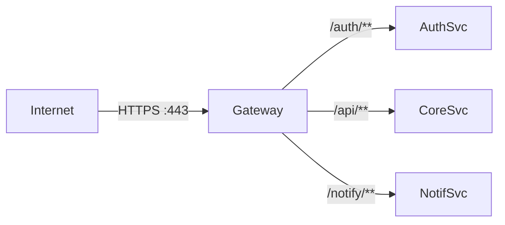
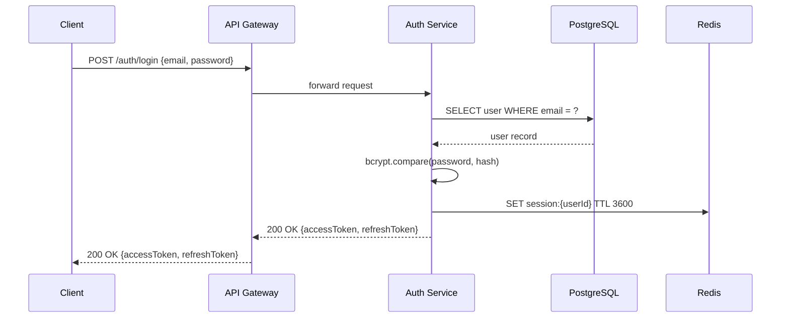
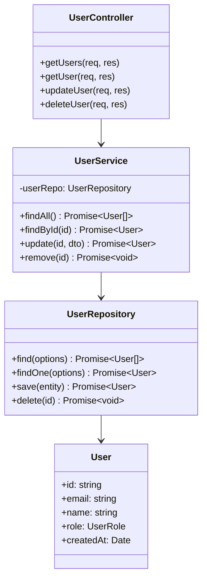
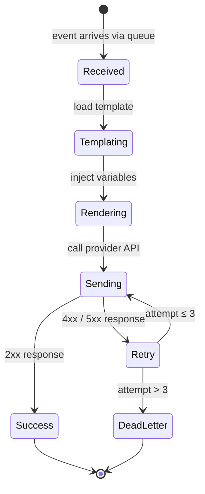
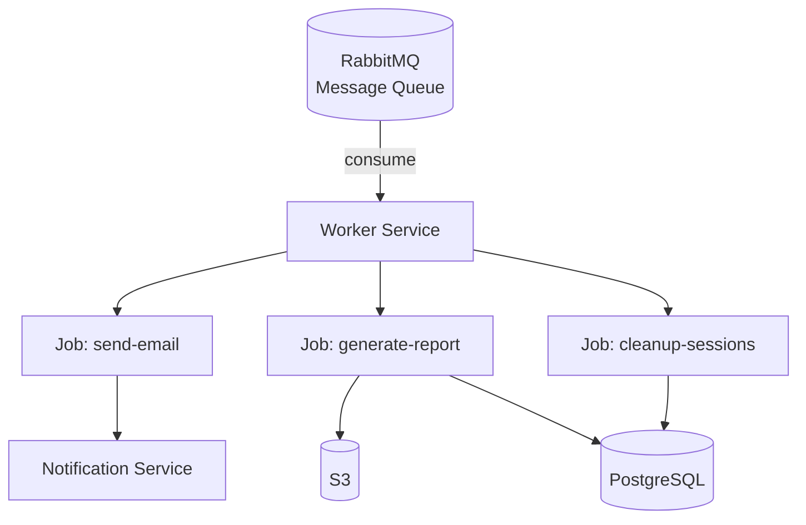

# Component Descriptions

This page provides a detailed breakdown of every service in the platform.

## Contents

- [API Gateway](#api-gateway)
- [Auth Service](#auth-service)
- [Core API](#core-api)
- [Notification Service](#notification-service)
- [Worker Service](#worker-service)

---

## API Gateway

| Property | Value |
|----------|-------|
| Technology | Nginx + Kong |
| Port | 443 (HTTPS) |
| Responsibility | TLS termination, rate limiting, request routing |

The gateway is the **only** publicly exposed entry point. All traffic is routed through it before reaching internal services.



### Rate Limiting Rules

| Tier | Requests / minute |
|------|-------------------|
| Anonymous | 30 |
| Free plan | 120 |
| Pro plan | 600 |
| Enterprise | Unlimited |

---

## Auth Service

| Property | Value |
|----------|-------|
| Technology | Node.js 20, Express 4 |
| Port | 3001 (internal) |
| Responsibility | Registration, login, JWT issuance, token refresh |



### Key Files

```
src/
  auth-service/
    controllers/
      auth.controller.ts   # Route handlers
    services/
      token.service.ts     # JWT sign / verify
      password.service.ts  # bcrypt helpers
    middleware/
      validate.ts          # Joi request validation
    routes/
      auth.routes.ts       # Express router
```

---

## Core API

| Property | Value |
|----------|-------|
| Technology | Node.js 20, Express 4, TypeORM |
| Port | 3002 (internal) |
| Responsibility | Business logic, CRUD operations, event publishing |



---

## Notification Service

| Property | Value |
|----------|-------|
| Technology | Node.js 20, Nodemailer, SendGrid SDK |
| Port | 3003 (internal) |
| Responsibility | Email and push notifications triggered by worker events |



---

## Worker Service

| Property | Value |
|----------|-------|
| Technology | Node.js 20, BullMQ |
| Port | None (outbound only) |
| Responsibility | Consume queue messages, run background jobs |


