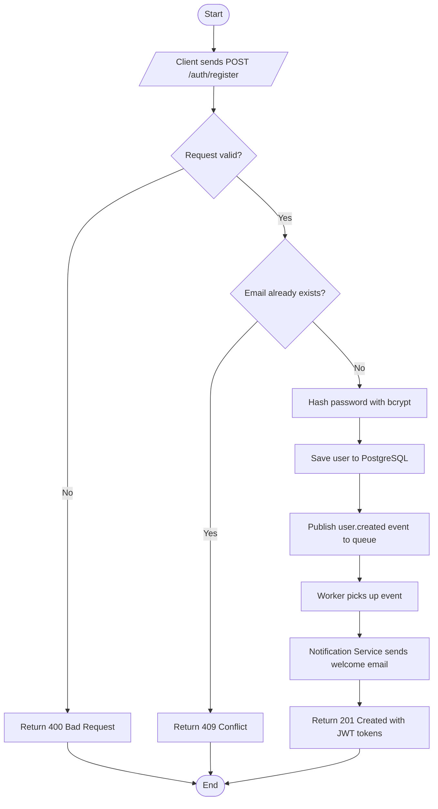
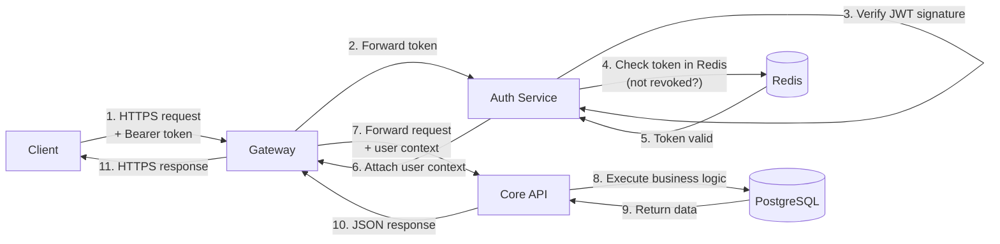
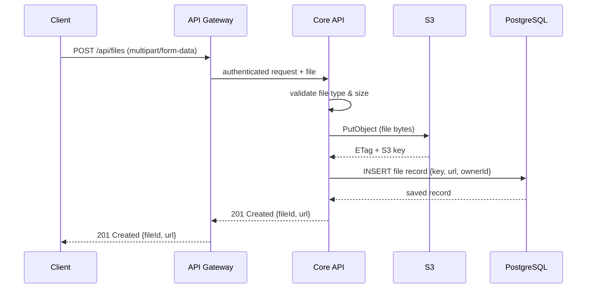
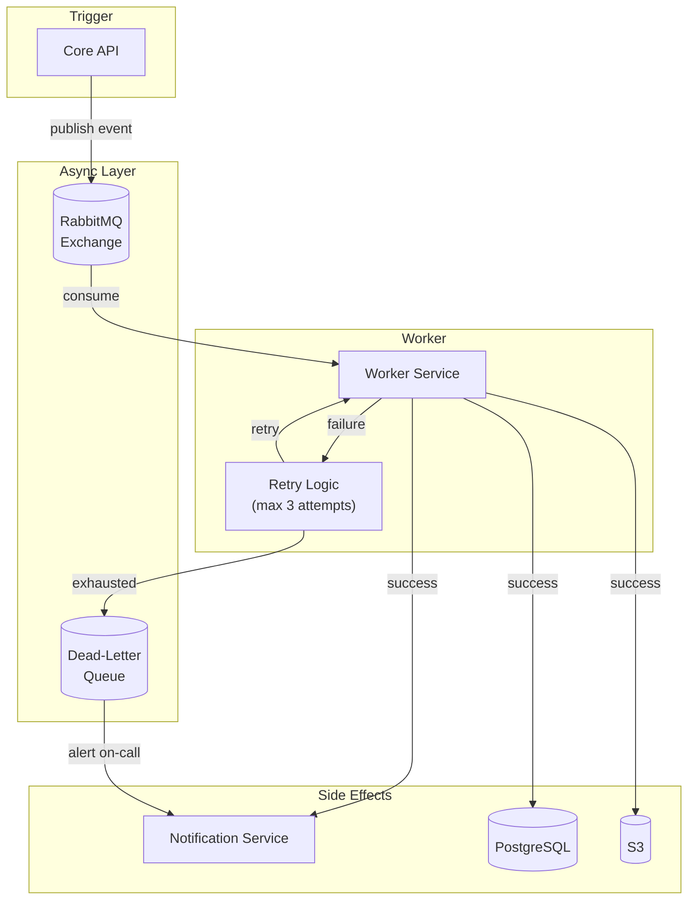

# Data Flow Diagrams

This page traces the end-to-end data flow for the platform's most important operations.

## Contents

- [User Registration Flow](#user-registration-flow)
- [Authenticated API Request Flow](#authenticated-api-request-flow)
- [File Upload Flow](#file-upload-flow)
- [Background Job Flow](#background-job-flow)

---

## User Registration Flow

---

## Authenticated API Request Flow

---

## File Upload Flow

---

## Background Job Flow

---

## Data Storage Summary

| Store | Type | Primary Use |
|-------|------|-------------|
| PostgreSQL | Relational RDBMS | Users, orders, products, audit logs |
| Redis | Key-value / cache | Session tokens, rate-limit counters, short-lived cache |
| S3 | Object storage | User-uploaded files, generated reports, static assets |
| RabbitMQ | Message broker | Async event bus between services |
