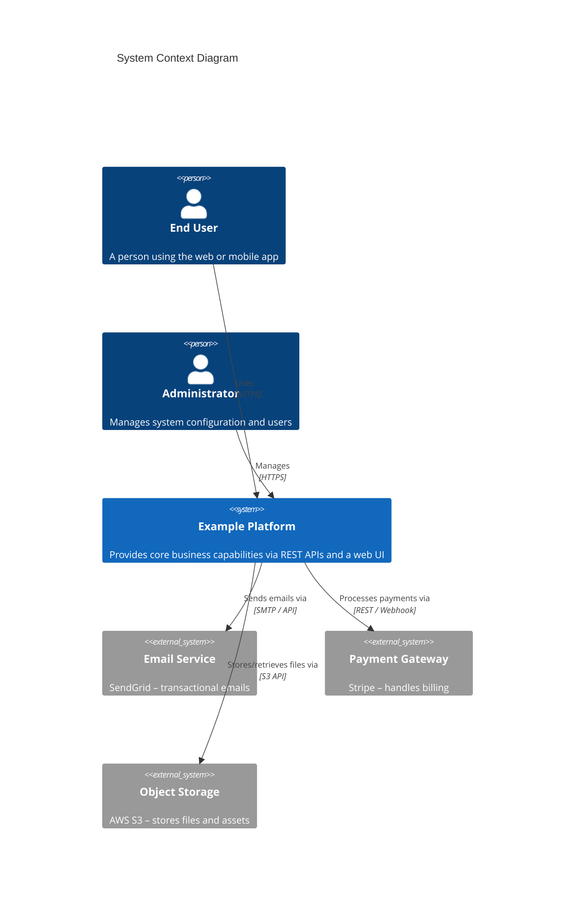
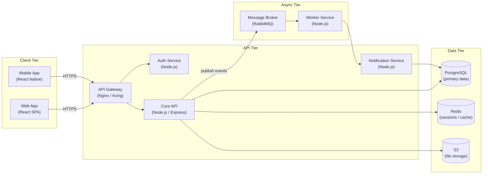

# Architecture Overview

This document describes the high-level architecture of the system, the major components, and how they interact.

## Contents

- [System Context](#system-context)
- [Container Architecture](#container-architecture)
- [Component Breakdown](#component-breakdown)
- [See Also](#see-also)

---

## System Context

The system follows a **microservices** pattern with an API Gateway acting as the single entry point for all client traffic.

---

## Container Architecture

---

## Component Breakdown

See [components.md](./components.md) for detailed descriptions of each service, and [data-flow.md](./data-flow.md) for end-to-end data-flow diagrams.

---

## See Also

- [API Reference](../api/overview.md)
- [Getting Started Guide](../guides/getting-started.md)
- [Development Setup](../development/setup.md)
