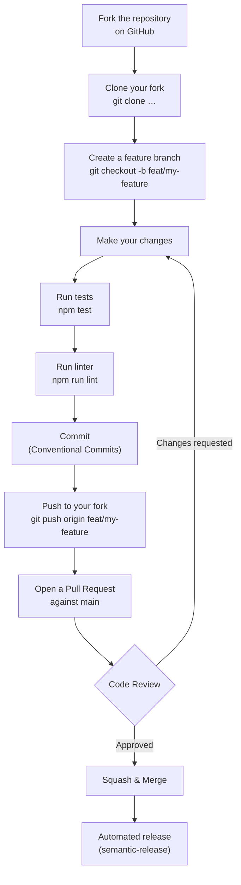
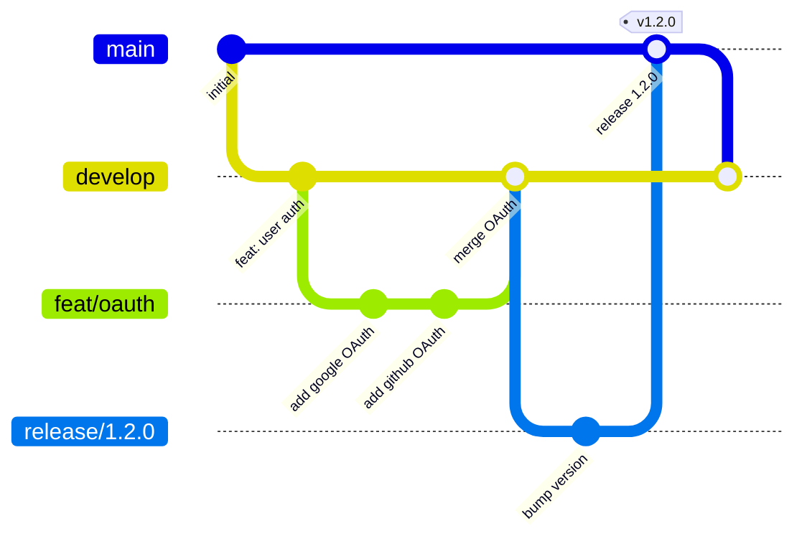

# Contributing Guide

Thank you for contributing! Please read this guide before opening a pull request.

## Contribution Workflow



## Branching Strategy



## Pull Request Checklist

Before submitting a PR, ensure:

- [ ] Tests pass (`npm test`)
- [ ] Linting passes (`npm run lint`)
- [ ] No new TypeScript errors (`npm run build`)
- [ ] PR title follows Conventional Commits format
- [ ] Relevant documentation is updated
- [ ] If adding an API endpoint, the [endpoints.md](../api/endpoints.md) is updated

## Code Review Guidelines

Reviewers look for:

| Area | What We Check |
|------|--------------|
| **Correctness** | Does the code do what it claims? Are edge cases handled? |
| **Security** | No injection risks, secrets in code, or insecure patterns |
| **Performance** | No obvious N+1 queries, unnecessary loops, or memory leaks |
| **Tests** | Is the new code covered by meaningful tests? |
| **Readability** | Is the code self-explanatory? Are variable names clear? |
| **Documentation** | Are public APIs and complex logic documented? |

## Reporting Bugs

When filing a bug report, include:

1. **Steps to reproduce** – precise steps that always trigger the bug
2. **Expected behaviour** – what should happen
3. **Actual behaviour** – what actually happens
4. **Environment** – OS, Node version, Docker version

Use the GitHub issue template: `.github/ISSUE_TEMPLATE/bug_report.md`

## Suggesting Features

Open a **GitHub Discussion** in the *Ideas* category before opening an issue. This lets the team validate the idea before implementation begins.

## Commit Message Examples

```bash
# Good
git commit -m "feat(auth): add TOTP two-factor authentication"
git commit -m "fix(core): handle null user in order controller"
git commit -m "docs(guides): add Kubernetes deployment section"
git commit -m "test(worker): add unit tests for retry logic"

# Bad – avoid these patterns
git commit -m "WIP"
git commit -m "fixed stuff"
git commit -m "changes"
```

## License

By contributing, you agree that your contributions will be licensed under the project's [MIT License](../../LICENSE).
