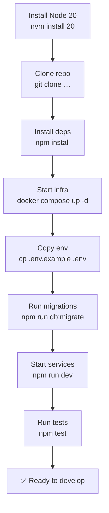

# Development Setup

This page gets a new contributor's environment ready for local development and debugging.

## Prerequisites

- Node.js 20 LTS (use [nvm](https://github.com/nvm-sh/nvm) or [fnm](https://github.com/Schniz/fnm) to manage versions)
- Docker Desktop 24+
- Git 2.40+
- An editor with TypeScript support (VS Code recommended)

## Repository Structure

```
project/
├── services/
│   ├── auth/          # Auth Service (Node.js / Express)
│   ├── core/          # Core API    (Node.js / Express / TypeORM)
│   ├── notif/         # Notification Service
│   └── worker/        # Background Worker (BullMQ)
├── packages/
│   ├── shared/        # Shared types, DTOs, utilities
│   └── logger/        # Structured logger wrapper (Pino)
├── k8s/               # Kubernetes manifests
├── docker/            # Dockerfiles and compose files
├── docs/              # This documentation
└── scripts/           # Developer scripts (migrations, seeds, …)
```

## Setup Steps



## VS Code Extensions

The project ships a `.vscode/extensions.json` that recommends:

| Extension | Purpose |
|-----------|---------|
| `dbaeumer.vscode-eslint` | Inline ESLint feedback |
| `esbenp.prettier-vscode` | Auto-format on save |
| `prisma.prisma` | TypeORM / SQL syntax highlighting |
| `streetsidesoftware.code-spell-checker` | Catch typos |
| `bierner.markdown-mermaid` | Preview Mermaid diagrams in MD files |

## Useful NPM Scripts

| Script | Description |
|--------|-------------|
| `npm run dev` | Start all services with hot-reload |
| `npm run build` | Compile TypeScript for all services |
| `npm run lint` | Run ESLint across the monorepo |
| `npm run format` | Run Prettier |
| `npm test` | Run all unit + integration tests |
| `npm run test:watch` | Run tests in watch mode |
| `npm run db:migrate` | Apply pending migrations |
| `npm run db:migrate:rollback` | Rollback last migration batch |
| `npm run db:seed` | Seed the database with sample data |
| `npm run logs` | Tail logs from all Docker containers |

## Debugging

### VS Code Launch Configuration

```json
// .vscode/launch.json
{
  "version": "0.2.0",
  "configurations": [
    {
      "type": "node",
      "request": "attach",
      "name": "Attach to Core API",
      "port": 9229,
      "restart": true,
      "sourceMaps": true,
      "outFiles": ["${workspaceFolder}/services/core/dist/**/*.js"]
    }
  ]
}
```

Start the service in debug mode:

```bash
npm run dev:debug --workspace=services/core
# Service starts with --inspect=0.0.0.0:9229
# Attach VS Code debugger to port 9229
```

## Code Style

- **TypeScript** strict mode is enabled.
- **ESLint** + **Prettier** enforce style automatically.
- **Conventional Commits** format is required for commit messages:

```
feat(auth): add refresh token rotation
fix(core): prevent duplicate email on registration
docs(api): update authentication endpoint examples
```

Commit message types:

| Type | When to use |
|------|-------------|
| `feat` | A new feature |
| `fix` | A bug fix |
| `docs` | Documentation changes only |
| `refactor` | Code change that is neither a fix nor a feature |
| `test` | Adding or updating tests |
| `chore` | Build, CI, or tooling changes |
