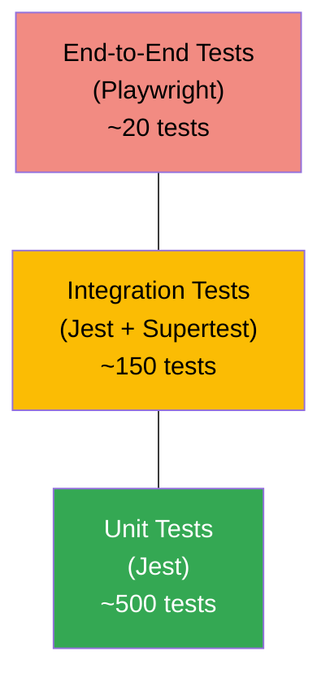
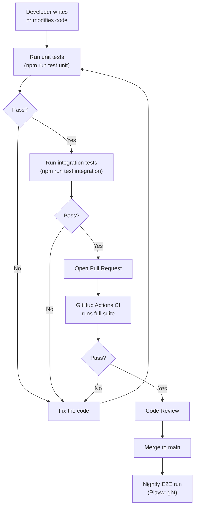
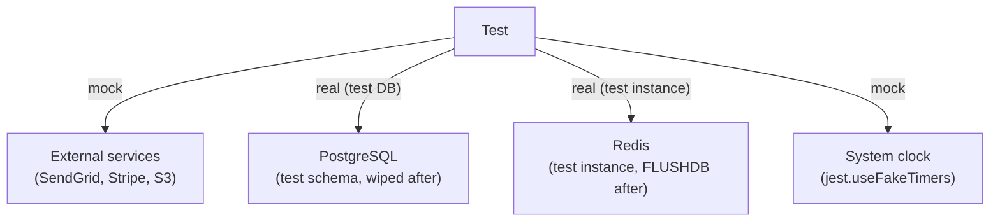

# Testing Guide

This page describes the testing strategy, tooling, and conventions used across the project.

## Testing Pyramid



| Layer | Tool | Scope | Speed |
|-------|------|-------|-------|
| Unit | Jest | Single function / class in isolation | < 1 ms each |
| Integration | Jest + Supertest | Service + real DB (test schema) | ~50 ms each |
| E2E | Playwright | Full user journey through UI | ~5 s each |

## Running Tests

```bash
# All tests (unit + integration)
npm test

# Unit tests only
npm run test:unit

# Integration tests only
npm run test:integration

# E2E tests (requires running services)
npm run test:e2e

# Watch mode (unit only, great for TDD)
npm run test:watch

# Coverage report
npm run test:coverage
```

## Unit Test Example

```typescript
// services/core/src/services/__tests__/user.service.test.ts
import { UserService } from '../user.service';
import { UserRepository } from '../../repositories/user.repository';

jest.mock('../../repositories/user.repository');

describe('UserService', () => {
  let service: UserService;
  let repoMock: jest.Mocked<UserRepository>;

  beforeEach(() => {
    repoMock = new UserRepository() as jest.Mocked<UserRepository>;
    service  = new UserService(repoMock);
  });

  describe('findById', () => {
    it('returns the user when found', async () => {
      const mockUser = { id: '123', name: 'Jane', email: 'jane@example.com' };
      repoMock.findOne.mockResolvedValue(mockUser);

      const result = await service.findById('123');

      expect(repoMock.findOne).toHaveBeenCalledWith({ where: { id: '123' } });
      expect(result).toEqual(mockUser);
    });

    it('throws NotFoundException when user not found', async () => {
      repoMock.findOne.mockResolvedValue(null);

      await expect(service.findById('999')).rejects.toThrow('User not found');
    });
  });
});
```

## Integration Test Example

```typescript
// services/core/src/controllers/__tests__/user.controller.test.ts
import request from 'supertest';
import { app } from '../../app';
import { dataSource } from '../../database';

beforeAll(async () => {
  await dataSource.initialize();
  await dataSource.runMigrations();
});

afterAll(async () => {
  await dataSource.dropDatabase();
  await dataSource.destroy();
});

describe('GET /api/v1/users', () => {
  it('returns 401 when unauthenticated', async () => {
    const res = await request(app).get('/api/v1/users');
    expect(res.status).toBe(401);
  });

  it('returns paginated user list for admin', async () => {
    const token = await getAdminToken(); // test helper

    const res = await request(app)
      .get('/api/v1/users?page=1&limit=5')
      .set('Authorization', `Bearer ${token}`);

    expect(res.status).toBe(200);
    expect(res.body.data).toBeInstanceOf(Array);
    expect(res.body.meta).toMatchObject({ page: 1, limit: 5 });
  });
});
```

## Test Flow Diagram



## Coverage Requirements

| Layer | Minimum Coverage |
|-------|-----------------|
| Unit (lines) | 80% |
| Unit (branches) | 75% |
| Integration | Key happy-path + error cases covered |

Enforce coverage thresholds in `jest.config.ts`:

```typescript
// jest.config.ts
export default {
  coverageThreshold: {
    global: {
      lines:    80,
      branches: 75,
      functions: 80,
    },
  },
};
```

## Mocking Guidelines



- **Always mock** third-party HTTP calls (use `nock` or `msw`).
- **Use a real test database** for integration tests – avoid mocking the data layer.
- **Use `jest.useFakeTimers()`** whenever time-based logic (expiry, retries) is tested.
