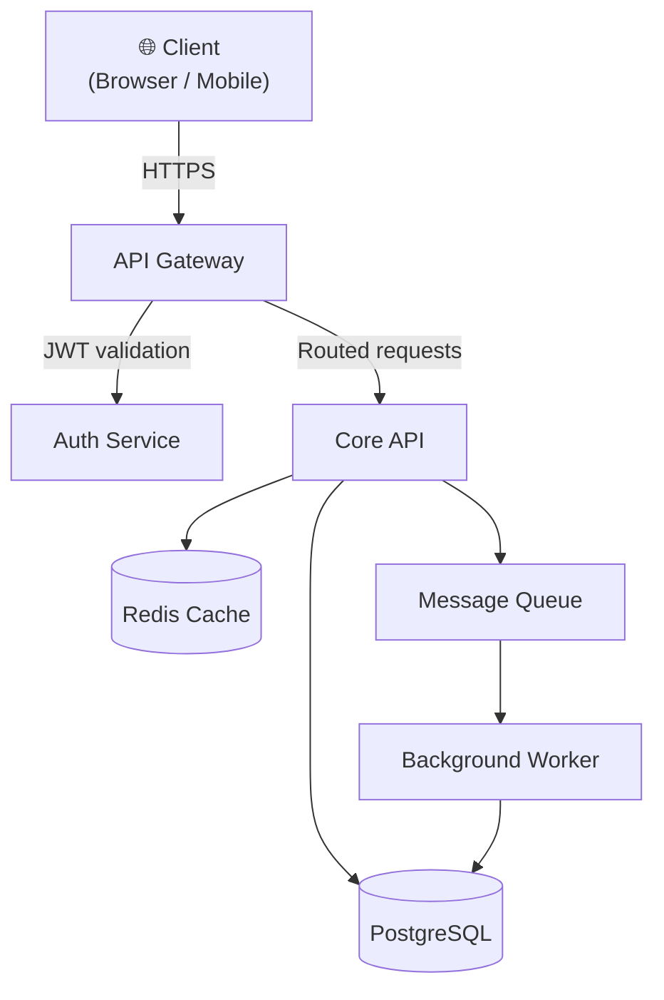

# Project Documentation

Welcome to the project documentation. This site contains architecture diagrams, API references, developer guides, and more.

## Sections

| Section | Description |
|---------|-------------|
| [Architecture](./architecture/overview.md) | System design, component diagrams, and data-flow diagrams |
| [API Reference](./api/overview.md) | REST API overview, authentication, and endpoint catalogue |
| [Guides](./guides/getting-started.md) | Installation, configuration, and getting-started tutorials |
| [Development](./development/setup.md) | Local setup, contributing guidelines, and testing practices |

## Quick-start

```bash
# Clone the repository
git clone https://github.com/example/project.git
cd project

# Install dependencies
npm install

# Start the development server
npm run dev
```

## High-level System Diagram



> **Tip:** Every section contains Mermaid diagrams that render in GitHub, GitLab, and most modern documentation platforms.
